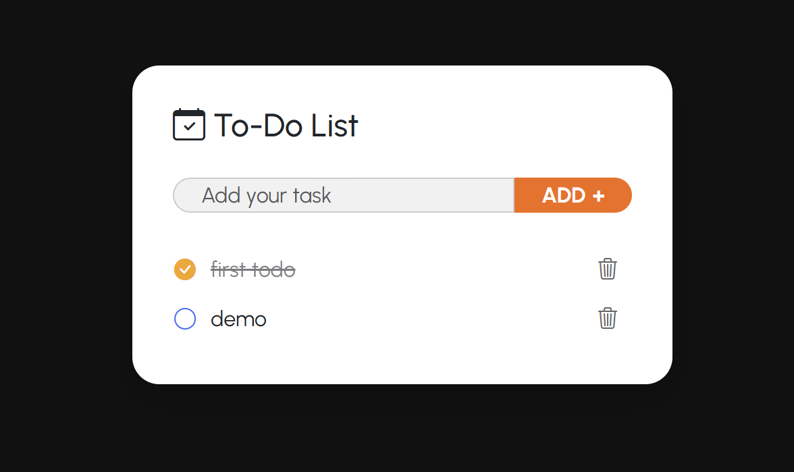

# 📝 Todo App 

## 📌 Giới thiệu
Dự án **Todo App** được phát triển bằng **Spring Boot** kết hợp với **Thymeleaf** để quản lý công việc hằng ngày (to-do list).  

Người dùng có thể:
- ➕ Thêm công việc
- ✅ Đánh dấu hoàn thành / chưa hoàn thành
- ❌ Xóa công việc

## 📸 Giao diện


Ứng dụng sử dụng **MySQL Database** để lưu trữ dữ liệu.

---

## ⚙️ Công nghệ sử dụng
- **Java 22**
- **Spring Boot**
  - Spring Web
  - Spring Data JPA
  - Thymeleaf
  - MySQL Driver
- **Bootstrap Icons**
- **Maven**

---

## 📂 Cấu trúc thư mục
```
src
 └── main
     ├── java/com/rhna/todoapp
     │   ├── controller      # Controller (TodoController)
     │   ├── entity          # Entity (TodoEntity)
     │   ├── repository      # Repository (TodoRepository)
     │   └── TodoApplication.java
     └── resources
         ├── templates       # Giao diện Thymeleaf (index.html)
         └── application.properties
```

---

## ⚙️ Cấu hình MySQL

Trong file `src/main/resources/application.properties`:

```properties
spring.datasource.url=jdbc:mysql://localhost:3306/todoappdb
spring.datasource.username=root
spring.datasource.password=your_password

spring.jpa.hibernate.ddl-auto=update

spring.jpa.show-sql=true

```

👉 Lưu ý:
- `todoappdb` là tên database, cần tạo trước trong MySQL:
  ```sql
  CREATE DATABASE todo_db;
  ```
- Thay `your_password` bằng mật khẩu MySQL của bạn.

---

## 🚀 Chạy ứng dụng

### 1️⃣ Clone repo
```bash
git clone https://github.com/Ngocanhjr/Todo_App
cd Todo_App

```

### 2️⃣ Build & Run bằng Maven
```bash
./mvnw spring-boot:run
```

### 3️⃣ Truy cập ứng dụng
👉 [http://localhost:8080](http://localhost:8080)

---

## 📜 Giấy phép
MIT License.
